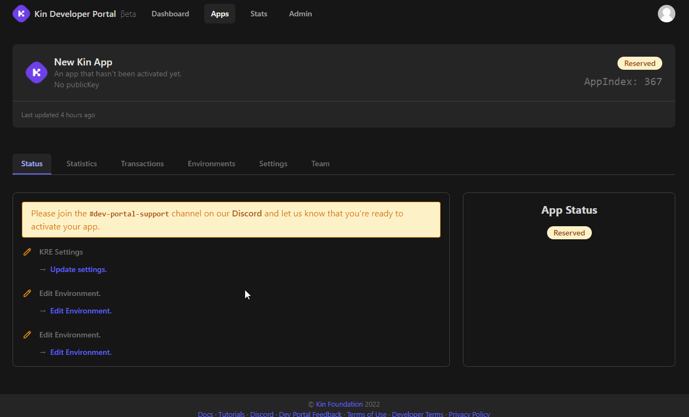

# Tutorials

To get started with Kin:

1. Read through the [Getting Started](#getting-started) section below
2. Breeze through a tutorial:
   - [iOS](/tutorials/ios/)
   - [Android / Kotlin](/tutorials/android-kotlin/)
   - [Android / Java](/tutorials/android-java/)
   - [Node (TypeScript)](/tutorials/node/)
   - [Go](/tutorials/go/)
   - [Python](/tutorials/python/)
   - [React Native](/tutorials/react-native/)
   - [Web](/tutorials/web/)
3. When you're ready to register your app, create an account on the [Developer Portal]()
4. If you have questions or just want to connect, join the [Kin Developer Discord](https://discord.gg/kdRyUNmHDn)

## Getting Started

For production, you will need a client and server side implementation. But to get started exploring what Kin can do, we recommend begining with the client side where you can start making transactions on the Test Network in as little as 5 steps!

### Prerequisites

Create a free account on [heroku](https://heroku.com/). This is optional, but will help you run and understand our server tutorials faster. Alternatively, you can adjust our set up to work with your preferred server.

### Steps

Follow the steps below to prepare your app for Kin integration.

1. Create an empty `variables.txt` file on your desktop. Use it to save any variables we mention below in `Bold Text` (1 minute)

   - You will be collecting these variables from different sources, and eventually add them to your code. It is helpful to have them in one place for easy reference.
   - For security, keep this text file offline, as it will contain some sensitive info.

2. Register your app and get your **`App Index`** (2 minutes)

   #### Why Register Your App

   - Registered apps receive an **`App Index`** which is used to track Kin activity. Developers are rewarded with Kin for creating activity with Kin in their apps.

   #### How to Register Your App

   1. Create an account on the [Kin Developer Portal](https://portal.kin.org/register)
   2. Open the email sent to the account used during registration and follow the instructions to verify your account
   3. Login to the [Kin Developer Portal](https://portal.kin.org) and navigate to [Apps](https://portal.kin.org/apps)
   4. Click [Create App](https://portal.kin.org/apps/create), fill in your details, and submit

   Congrats! Your app is now registered!

   At anytime, you can navigate back to the Apps section to find your **`App Index`** or manage:

   - Your [app settings](https://portal.kin.org/apps)
   - Your environments (production and testing)

3. Create your app `public key` and `private key` at the [Kin Laboratory](https://laboratory.kin.org/#account-creator?network=test). (1 minute)

   - Just hit Generate keypair and save both values.
   - Your public key is your server's Kin address. (Also called public address). Your app will need this to send Kin to your server.
   - Keep your private key secret and never share it with anyone

4. Log on to [heroku](https://heroku.com/) or your preferred server and create a new blank server app. (5 minutes)

   - Save the `server url` to your variables list. E.g. `https://kin-server.herokuapp.com`
   - Save a `server webhook` endpoint. E.g. `https://kin-server.herokuapp.com/kinWebHook`
   - Save a `server events` endpoint. E.g. `https://kin-server.herokuapp.com/kinTransactionEvents`
   - You can name the endpoints however you like.
   - Don't worry, we will create these in a later tutorial. We just need to know what their names are for now.

5. Go to https://passwordsgenerator.net/ and generate a strong password. (1 minute)

   - Save the password as `webhook password`

6. Return to the Developer Portal and Update Your Production Environment

   - Go to the [Apps section of the Developer Portal](https://portal.kin.org/apps)
   - Click on the `Settings` tab and add the following:
     - Name = the name of your app
     - Description = description of your app
     - KRE Contact = contact that receives updates about KRE Rewards
     - KRE Email = email address to receive updates about KRE Rewards
     - Other settings are optional
     

   - Click on the `Environments` tab and then click the `Prod` button and add the following:
     - Public Key = the `public key` you created in step 3 above
     - Webhook Secret = the `webhook password` you create in step 5 above
     - Events Webhook = the `Server Events` created in step 4 above
     - Transactions Webhook = `Server Webhook` created in step 4 above
     

   The Kin foundation now has all the data they need to reward you for implementing Kin in your app. We will use all these variables in later tutorials, and also learn how to use webhooks and invoicing to send payments. You will be surprised at how easy it is to implement Kin into any app.

   You can start building with Kin immediately.

### Congratulations!

You have completed the preliminary steps to integrating your app with Kin, and you are now ready to get started. Pick the next tutorial to integrate your app. We recommend starting with the client side code first. E.g. Android, iOS, etc.

### Note on public keys

The Kin SDK uses public keys in two formats:

1.  Stellar: `GCGP67EMU6L3OXEDDPFJWE7WJUNAYKXL6LBQJ27RXDURSINQ7DCBZ3HO`
2.  Solana: `AVQ2pAR7PnuRz2oGQ7i5BB2dFYDLdRJC7B3sFU9nGCfD`

The two keys above are different representations of the same blockchain address. For consistency, use the Stellar format _only_ to instantiate SDK's (where required). This is the Key you provide to the Kin Foundation above.

In all other instances, use the Solana format for consistency. The Stellar format is an artefact from Kin's previous blockchain.
