# NFTs With Kin ||80

So you have that fire NFT concept ready to make it's way into the metaverse but you have a few problems:

- You need to design the NFTs
- Mint the NFTs
- Write code to auction them
- Build a distribution website
- etc ...

We wrote this for all of those 'would be' NFT Creators — especially in the Kin community — who are looking for a simple but fully explained solution to setting up, minting, and launching an NFT store.

### In the coming 30 minutes, we'll walk you through:

1. Creating a wallet to house your NFTs, SOL, and Kin
2. Ensuring you have the right dependencies installed on your computer
3. Spinning up an NFT store and enabling it with Kin
4. Connecting your store to your wallet
5. Creating your first NFT in the Devnet
6. Launching your NFT for sale on the Devnet
7. Putting your storefront onto the Mainnet

We've a lot to do, so let's get started.

If you already know what Solana, Metaplex, and Phantom Wallet are, you can skip the next section.

## Solana, Metaplex, and Phantom Wallet

It's unlikely you would've found your way here if you didn't know what Solana is, but just in case , here's a quick overview of Solana and Metaplex.

### Solana

[Solana](https://solana.com/), SOL, is a blockchain platform that uses Proof of Stake and Proof of History as its consensus mechanisms. It's ranked as one of the fastest blockchains in the cryptoverse, handling roughly 50,000 transactions per second.

Kin is part of the Solana ecosystem and the leading token on the platform.

### **Metaplex**

[Metaplex](https://metaplex.com/) blends an NFT store front, a generative NFT minting machine, a collection of smart contracts, and a set of helper functions that make minting and selling NFTs cost effective and easy.

Metaplex is built on Solana. It was originally created by the same development team but has since been spun out as a separate entity to enable them to focus solely on creator experiences.

### **Phantom Wallet**

[Phantom](https://phantom.app/) is one of the wallets specifically built for the Solana blockchain. It enables users to send and receive Kin, Solana, and NFTs in a slick browser based UI.

## Creating The Wallet

First, you may want to stop and grab something to write with — this part is important.

You will need to write down the secret phrase that you will need to not only access your wallet but also your NFT store and any NFTs you mint. Even if you think you'll never use the account and store beyond this tutorial, it's a good idea to record your secret phrase anyway.

For this tutorial, we'll use Phantom Wallet with Chrome. We suggest using both to make following along easier.

Navigate to [https://phantom.app/download](https://phantom.app/download) and then select "Add to Chrome."


Then, again, "Add to Chrome"


After installing, open Phantom Wallet and click the "Create New Wallet" button.

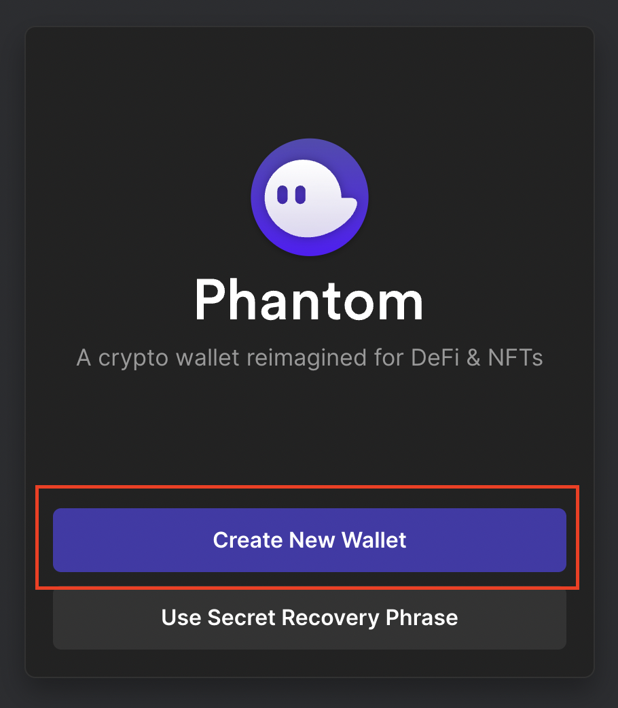

Now carefully write down your secret phrase, and store it somewhere safe. If you transfer in tokens and mint NFTs on the Mainnet and then lose your secret phrase, your NFTs, store access, and tokens will not be recoverable.

If you don't know what a secret phrase is, here's a [1 minute video that explains it](https://www.youtube.com/watch?v=cc7faLQ3Chk).

Create a strong password, ensure you safely store it, and then click "Save". As an aside, [Lastpass.com](https://lastpass.com) is a good option for creating and storing strong passwords.

## Funding The Wallet

Now that we have a shiny new wallet, let's airdrop in some funds:

1. Navigate to [https://solfaucet.com/](https://solfaucet.com/)
2. Open Phantom Wallet
3. Switch to the `devnet` by clicking on the gear icon in the bottom right
4. Scroll down to, and click on, "Change Network"
5. Scroll down to, and click on, "Devnet"
6. At the top of your Phantom Wallet, click on your wallet name and public key — this will copy your public key to your clipboard
7. Paste the copied public key into [https://solfaucet.com/](https://solfaucet.com/) and click on the "DEVNET" button.
8. Open your wallet and enjoy your newly found fake wealth — sadly, it is fake but we can test with it as if it were real

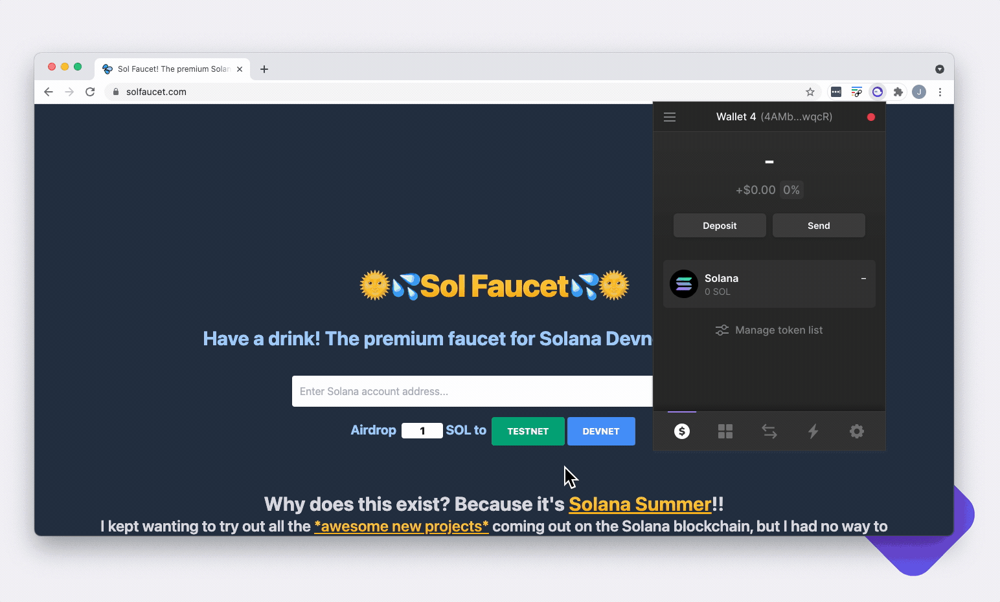

## Installing Dependencies

In the next step, we'll start setting up the store but first we need to ensure we have the following prerequisites installed:

1. `Node.js`(at or above versions `14.17.0` )
2. `yarn`

### Installing Node

Rather than repeating the many tutorials on how to install Node and yarn, we'll recommend a few below for Mac, Windows, or Linux:

**Mac:**

- **Written:** [https://phoenixnap.com/kb/install-npm-mac](https://phoenixnap.com/kb/install-npm-mac)
- **Video:** [https://www.youtube.com/watch?v=0i-gstqgjuE](https://www.youtube.com/watch?v=0i-gstqgjuE)

**Windows:**

- **Written:** [How to Set Up Node.js and npm on Windows](https://www.makeuseof.com/install-node-js-npm-windows/#:~:text=how%20to%20set%20up%20node.js%20and%20npm%20on%20windows)
- **Video:** [https://www.youtube.com/watch?v=Gu9KdbpzSvk](https://www.youtube.com/watch?v=Gu9KdbpzSvk)

**Linux:**

- **Written:** [https://linuxhint.com/how-to-install-latest-node-js-on-linux/](https://linuxhint.com/how-to-install-latest-node-js-on-linux/)
- **Video:** [https://www.youtube.com/watch?v=fxxmMqh_WWY](https://www.youtube.com/watch?v=fxxmMqh_WWY)

### Installing Yarn

**Mac:**

- **Written:** [https://www.geeksforgeeks.org/how-to-install-yarn-in-macos-ubuntu-windows/](https://www.geeksforgeeks.org/how-to-install-yarn-in-macos-ubuntu-windows/)
- **Video:** [https://www.youtube.com/watch?v=p5QMDOZEzgs](https://www.youtube.com/watch?v=p5QMDOZEzgs)

**Windows:**

- **Written:** [https://www.geeksforgeeks.org/how-to-install-yarn-in-macos-ubuntu-windows/](https://www.geeksforgeeks.org/how-to-install-yarn-in-macos-ubuntu-windows/)
- **Video:** [https://www.youtube.com/watch?v=TyGCZZaY0yc](https://www.youtube.com/watch?v=TyGCZZaY0yc)

**Linux:**

- **Written:** [https://www.geeksforgeeks.org/how-to-install-yarn-in-macos-ubuntu-windows/](https://www.geeksforgeeks.org/how-to-install-yarn-in-macos-ubuntu-windows/)
- **Video:** [https://www.youtube.com/watch?v=B7T5vabyeis](https://www.youtube.com/watch?v=B7T5vabyeis) ( no sound but quick and to the point)

## Setting up the store

The store will be built using Metaplex.

To spin up a new store we first need to clone down the Metaplex repo using the following command.

`git clone https://github.com/metaplex-foundation/metaplex.git`


From the terminal, navigate into `metaplex/js`. Once in the folder run `yarn install && yarn bootstrap`


**The moment has finally arrived, it's time to fire up Metaplex!**

Run `yarn start` from the same folder and then navigate to `http://localhost:3000`. Note that you may have to wait 20 - 60 seconds for the site to fully start.


## Initializing your Store

_Note that you will need to repeat the six steps below when we go to mainnet_

To initialize our site we need to do a few quick things:

1. Ensure our storefront is using the devnet
2. Ensure our wallet is using the devnet
3. Connect to the storefront to our Phantom Wallet
4. Approve a transaction that will create an address for our store
5. Add the store address to our project
6. Add our wallet address, Kin Token Program address, and Kin token id to our our project

### Ensuring the storefront and wallet are on Devnet

- Navigate to `localhost:3000`
- Open Phantom Wallet
- Switch to the `devnet` by clicking on the gear icon in the bottom right
- Scroll down to, and click on, "Change Network"
- Scroll down to, and click on, "Devnet"
- Then, on the storefront, click on the gear icon in the upper right corner, click under "NETWORK" and select the "devnet" option

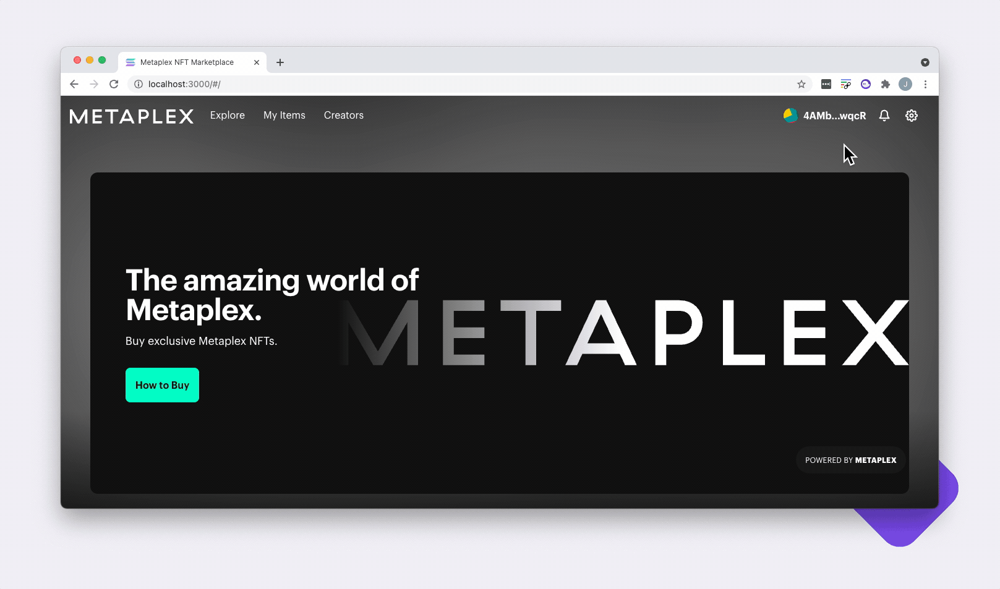

### Connecting the Wallet

Note that if you have multiple addresses in your Phantom Wallet, whichever address you had open last will be the one that initializes your store in the next step. If you want a particular address to be the one that gets associated to your store, then open that address in Phantom Wallet before moving on.

### Connect

- Ensure you're on `localhost:3000`
- On the storefront, click "Connect" (x2 if needed)
- In Phantom Wallet click "Connect"

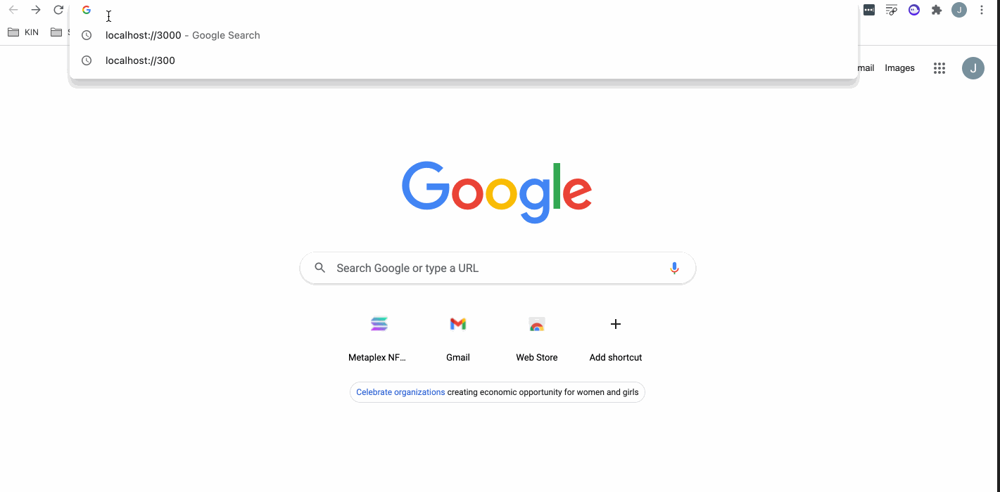

### Troubleshooting

If your storefront fails to connect or initialize, double check the following:

- Ensure you have fake SOL in your wallet. If not then [airdrop](https://solfaucet.com/) some into your account.
- Ensure your wallet is using the same network as your store (mainnet, devenet, testnet etc...)

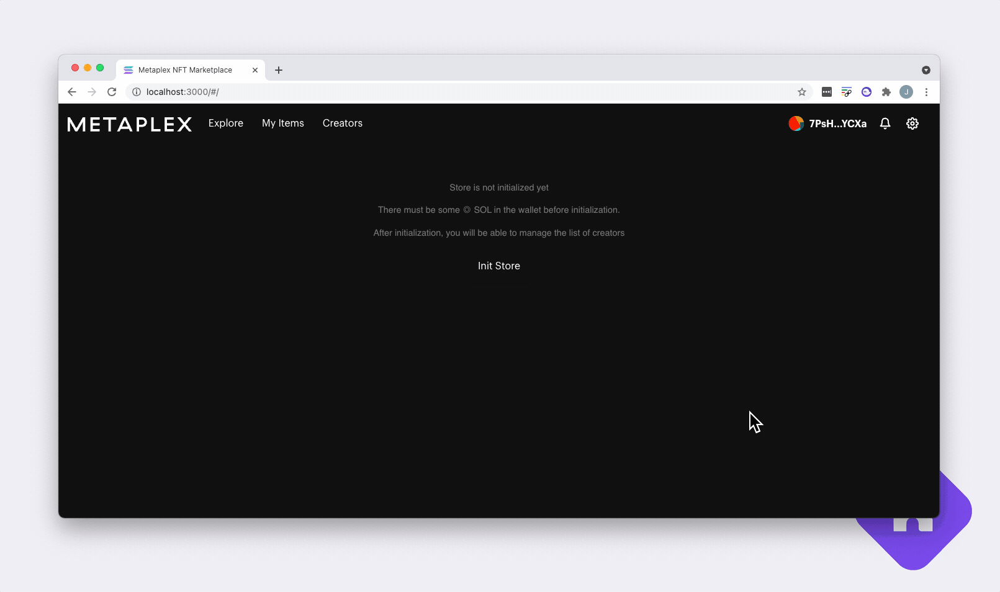

If the initialization is successful then you will see your Store Configuration information.

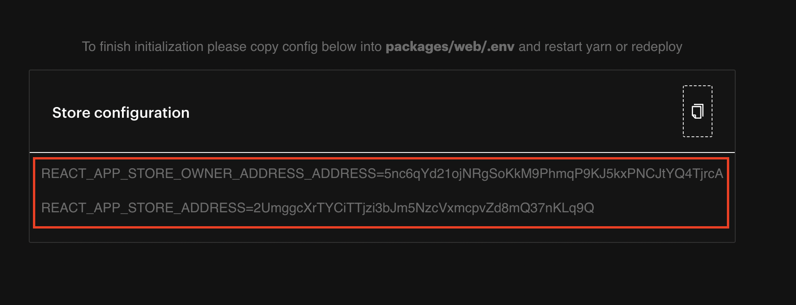

If the page keeps loading or you're not seeing your _Store Configuration_ — in our testing it sometimes hangs up here — then try refreshing the browser or navigating to [http://localhost:3000/#/admin](http://localhost:3000/#/admin)


### Add the Store Address

To add the _Store Configuration_:

- In VS Code, or your your preferred code editor, navigate to `./js/packages/web/.env` and open the .env file
- Paste in your copied configuration from the previous step — _your's and your store's public key_
- copy the snippet below and paste it under your _Store Configuration_. This snippet will allow you to sell NFTs using the Kin token

```tsx
//The Kin Token Mint Address
SPL_TOKEN_MINTS = kinXdEcpDQeHPEuQnqmUgtYykqKGVFq6CeVX5iAHJq6;
//Kin Token Id
CG_SPL_TOKEN_IDS = kin;
```

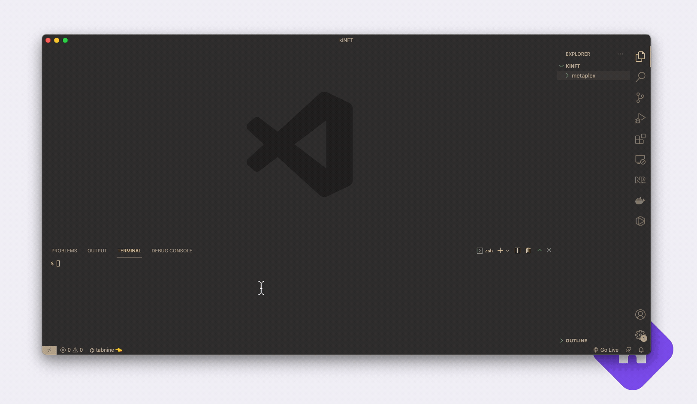

Now we can restart our store and mint our first NFT!!! ... almost.

In the terminal, type `control + c` (mac) / `ctrl + c` (windows) to shut down the server and then `yarn start` to restart it.

## Adding Creators

If you want to test adding additional creators to your mint, you need to add them before starting the next step. If you just want to get on with minting that first NFT — we don't blame you — then skip to "Creating Your First NFT".

To add a creator:

- You will need their Public Key _(later you will need them to verify with their wallet)_
- Navigate to [https://localhost:3000/#/admin](https://localhost:3000/#/admin)
- Click "Add Creator"
- Paste in their Public Key
- Click "Ok"
- Rinse and repeat for additional creators


## Creating your first NFT

To understand the next steps, it's important to understand that our NFT information — for the purposes of this tutorial — will live in two places:

1. **On Solana** — where the associated token will be minted and as well as a bit of data (a Decorator Struct) that describes the NFT and, importantly, where it's metadata lives
2. **On Arweave** — The metadata, the on-chain image link, description, traits etc..., will permanently live on Arweave

It's relatively expensive to store data on Solana, so Metaplex stores just enough data via the NFT (Token Program) on Solana to make a permanent record of where the more detailed metadata lives, on Arweave.

### Upload your image

To get started, click on the creator icon in the upper right-hand corner (next to the public key) and then click "Create" in the drop down.

You can add a variety of assets to an NFT but we're going to mint with an image by uploading the "official" kiNFT Tutorial graphic. If you would like to use the same image, download it here.


The graphic we select in this step will eventually be uploaded onto Arweave and its URL will be automatically added to the overall Matadata object.


### Add Details

Now we'll add the NFT details.


`Title`, `Description`, and `Maximum Supply` are self explanatory but if you've never minted an NFT before, `Attributes` may be harder to understand.

Attributes need three pieces of data

- **trait_type** — describes the trait itself e.g. a type of background, a particular hairstyle, a special power, or maybe you want to make it part of a set and label its place within a larger project
- **value** — describes an important detail about the trait_type e.g. it's name, a numerical value, whether or not a condition is true or false, an SKU etc...
- **display_type** — is optionally used by wallets and apps to display the data type e.g. a string, number, boolean, Date etc... the default value will be `string` if you leave it blank.

[Click here](#viewing-the-nft-and-metadata-in-phantom) to see how these details show up in Phantom Wallet


### Set Royalties

Royalties allow creators to enjoy a predetermined share of all future aftermarket sales. The amount you set here defines a 1-to-1 percentage to be withheld for all creators. e.g. adding 5 means you will automatically receive 5% of all future sales — split with all creators.


### Creator Splits

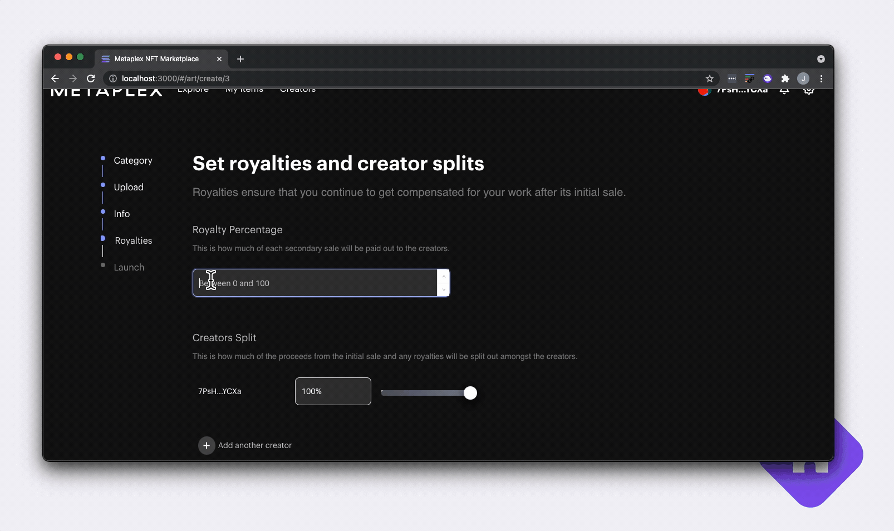

In order to add Creator Splits, you must first add additional creators. As of the time we wrote this, you can not add creators in the middle of the minting process. If you want to add creators to this mint, stop, go up to "[Adding Creators](/#adding-creators)", complete that process, and then repeat the creation steps above.

### IMPORTANT ASIDE _(Skip if You're Not Adding Creators)_

Metaplex enforces verification — as they should — before sales can happen. However, this may surprise people new to the space and lead to lost minting costs.

If you add a creator split, you **CAN NOT** list your item for sale — using Metaplex — until **ALL** creators verify their participation. This means that you can complete the minting process **and pay the associated costs** (rent) using unverified creators but then be **unable** to sell your NFT if one of the creators you added doesn't have access to their Solana Wallet.

Ensure that any creator you add in the [Creator Split](/#creator-splits) section — if using real SOL — has access to the wallet associated to the public key you entered when adding them as a creator.

Creators verify themselves by connecting their wallet and signing a transaction that validates their Keypair and associates it to your store. The connecting wallet must contain the same public key that was used to register them as a creator.

Each additional creator can validate their participation in a mint by doing the following:

- Navigate to your storefront
- Connect their Wallet
- Click on the bell notification
- Click on the "You Have New Artwork That You Need To Approve" header
- Approve the validation transaction by clicking "Approve"

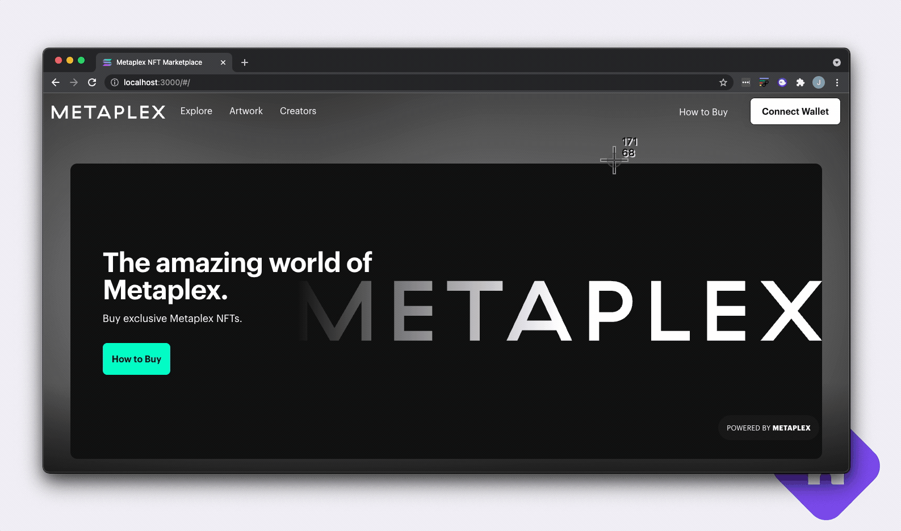

Note that after completing the steps above you may still see an "unverified" badge even though verification has occurred on chain. If that's the case, you may have to refresh your browser — or disconnect and reconnect to the storefront — in order to for the badge to disappear.

## Mint Your NFT

Now it's time to mint that beautiful NFT of yours.

To complete, you'll need to approve two transactions. We've only shown one below because there's a little _end-of-mint_ surprise provided by the lovely people at Metaplex that we shouldn't spoil and you should earn. ;).

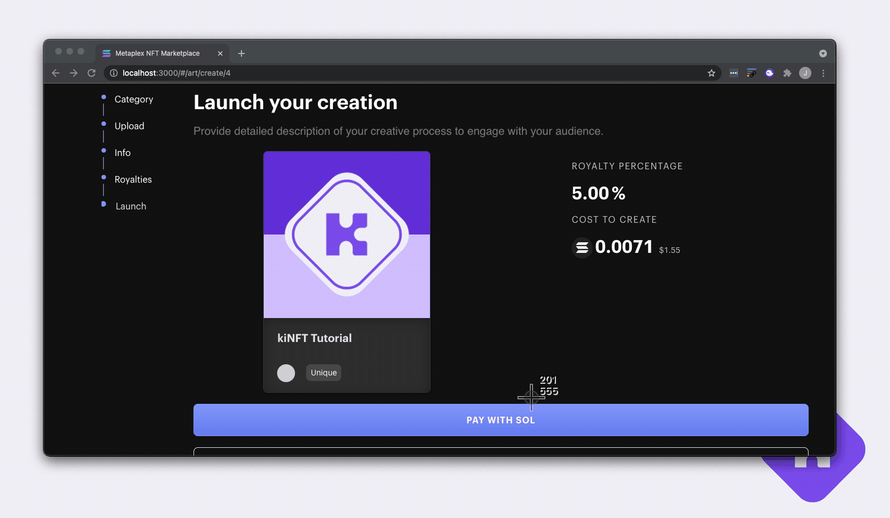

#### Viewing the NFT and Metadata in Phantom

Once the mint is complete, you can navigate to your wallet to see the "Master Edition" NFT. Note that it may take some time for the image to appear.

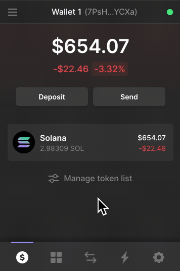

## Launching an Auction with Kin

Now we can put that stunning NFT up for sale.

There are a variety of selling options available to you through Metaplex, we'll be doing a _Limited Edition_ auction.

Our `NFT 0` is the Master Edition. It's from this token that we can create _Limited Edition_ prints up to the _Max Supply_ we set early. For this particular mint, our _Max Supply_ is 1,000 — let's mint and sell 10 prints from that Max Supply:

- Click on your profile icon/public key in the upper right hand corner of your screen
- Click "Sell"
- Select "Limited Edition" from the "List an Item" options
- Click "Add an NFT"
- Select the NFT we created earlier and then click "confirm"
- Click "Auction Mint" and then "Kin"
- Then enter the number of copies to create ... we'll do 10

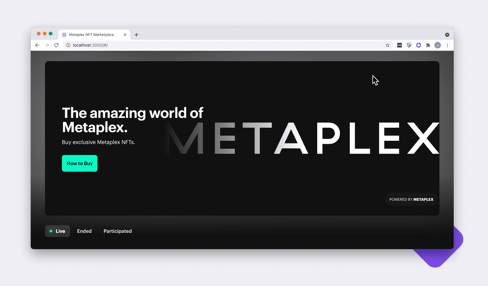

- Set the Price Floor in Kin — we'll set ours at 100,000
- Add the Tick Size — _defines the minimum amount each new bid must be in addition to the old bid. New Bid >= Old Bid + Tick Size. If the old bid is 200,000 and our Tick Size is 100,000 then the new bid must be at least 200,000 + 100,000_
- Click "Continue"
- Select when you want the Initial Phase to begin — well set ours to `Immediately`
- Add your **Auction Duration** — _how long your auction will last in minutes, days or hours_
- Select the **Gap Time** — _this sets the length of the final period of the Auction AND how much time will be added to the auction for each qualifying bid submitted during that span. For example, if your Gap Time is 5 minutes, the auction will be extended by 5 minutes for each bid received in the final 5 minute period. Oof ... that's a mouthful._
- Determine the **Tick Size Ending Phase** — the percentage increase over the previous bid that one must place to continue the auction in the final phase. e.g. If the Tick Size is 10% and the previous bid was 5000 Kin then the new bid must be at least 5500 to continue in the auction.

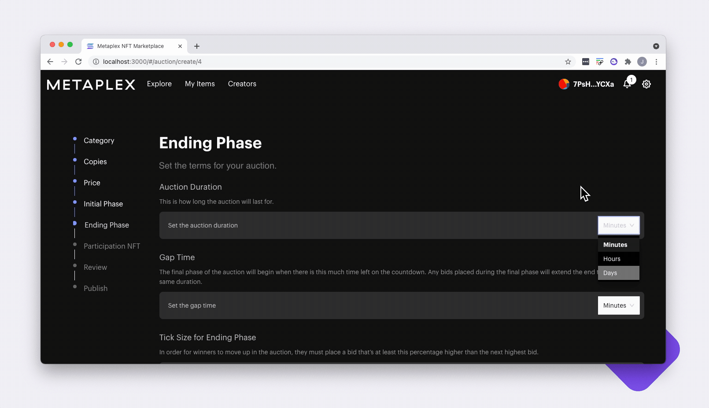

**Participation NFTs**

We'll skip over the next screen which allows one to add NFTs that can be given away or sold for participating in an auction. If you want to charge a fee, add a price into the `Fixed Price` field.

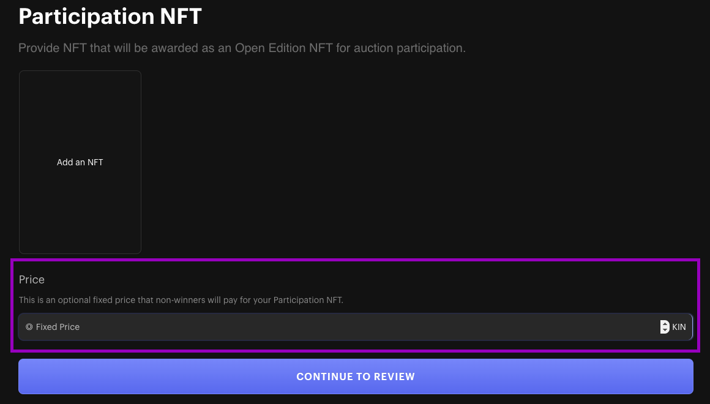

Just two more steps and our devnet Auction will be live ... we've sped up the .gif because this part can take a while:

1. Click "Continue to Review"
2. Then click "Publish Auctions"
3. And then approve the transactions in Phantom Wallet


**Note** that sometimes, Metaplex stalls in this step. If it does, don't worry. When you refresh or restart your storefront, there will be a notification waiting for you in the top right corner alerting you that an auction transaction didn't complete. Click on that notification to finish the transaction.

Wow, you made it to here ... you deserve an NFT!

Luckily, you now have the ability to make as many as you want and sell them for some sweet sweet Kin. So give yourself a pat on the back, take a photo while you're doing it, mint the photo, and slap that well earned back pat on-chain so it can be remembered for all eternity.

Oh. Before we go, we did promise to set you up on the Mainnet.

Let's do that quick but first it's important to note a few important things.

1. To complete this step, you will need a small amount of real SOL. At the time of writing this, it cost us, in total, 0.81 USD equivalent in SOL. Our USD equivalent balance changed from $1.96 to $1.15. You need SOL because initializing your store creates two on chain transactions that require "rent", aka transaction fees.
2. Currently, you need to be on the Mainnet to test purchasing with Kin
3. All of the NFTs you created on the Devnet won't be present on your store when you switch to Mainnet — you can always switch back to Devnet to gawk at them. Just be sure that your wallet AND the store are on the same network.

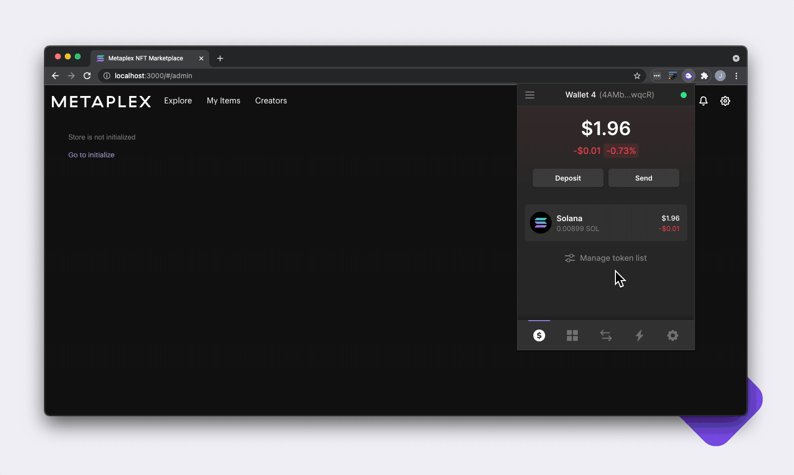

The gif above only shows the first transaction. For the curious, here are what both transactions look like.

Transaction One


Transaction Two


Now that our storefront is initialized we need to add the Mainnet Store Configuration details to `./js/packages/web/.env.production` .

If you need a refresher on how do that, click here [ADD ANCHOR LINK HERE].

### Welp! We did it!

That was 30 minutes well spent you pro-level NFT'er you.

If you would like to learn to deploy your site or brush up on your Metaplex knowledge, you can do that here [https://docs.metaplex.com/create-store/deploy](https://docs.metaplex.com/create-store/deploy)

For those interesting in building their NFT projects using Kin, if your project is going places, you can apply for a [Kin Foundation Catalyst Fund grant here](https://rebrand.ly/kin-funding).
